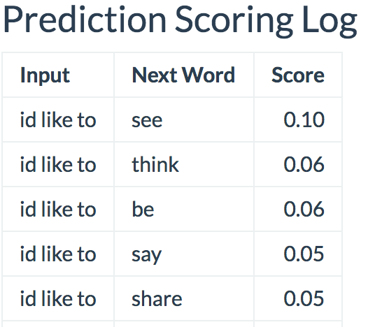

```{r setup, include=FALSE}
knitr::opts_chunk$set(echo = FALSE)
```

## Project Objectives

- **Learn and apply** basic *text mining and natural language processing (NLP)*
    + N-grams, discounting, backoff algorithms
- **Build and optimize** a practical *next-word prediction model*
    + Text mining, NLP, exploratory analysis, statistical inference, machine learning, R programming
- **Build and publish** an *application that predicts the next word* a user will type
    + Interactive data product, Shiny application framework

## Next-Word Prediction Model

- **Implements [Stupid Backoff](http://www.aclweb.org/anthology/D07-1090.pdf)**
    + Practical to implement, scaleable, accurate when trained on sufficiently large dataset
- **Preprocessing**
    + Document-term matrix (DTM) generation: [tm](https://cran.r-project.org/web/packages/tm/index.html)
    + Sentence and n-gram tokenization; stopwords, numbers, punctuation removal: [tokenizers](https://cran.r-project.org/web/packages/tokenizers/index.html) and `grep`
- **Training data**
    + Blogs (720K entries, 206MB), News (808K articles, 208MB)
- **N-gram scoring tables** (calculated at training time)
    + 4-gram, trigram, bigram and unigram
    + N-grams appearing less than 3x excluded

## Prediction Model Performance

**Accuracy** on held-out Blogs (10K entries), News (10K articles)

```{r echo=FALSE, message=FALSE, warning=FALSE, fig.height=1.5, fig.width=2}
source('~/Documents/Projects/DataScience/CapstoneProject_JHSK/capstonegitrepo/GetData.R')
source('~/Documents/Projects/DataScience/CapstoneProject_JHSK/capstonegitrepo/CreateCorpus.R')
source('~/Documents/Projects/DataScience/CapstoneProject_JHSK/capstonegitrepo/CreateModel.R')
projDir <- "~/Documents/Projects/DataScience/CapstoneProject_JHSK/"
dataDir <- paste0(projDir, "data/")
accuracyTbl <- evalSBOAccuracy(loadEvalTables("val"))
knitr::kable(accuracyTbl[, c("Label", "Top3", "Top5", "Top15")],
             col.names = c("_", "Top-3", "Top-5", "Top-15"))
```

<p></p>
**Response Time and Memory** 

- Load n-gram tables (Startup): 4.5s, 130MB RAM
- Each prediction: <20ms, negligable incremental RAM

## Next-Word Predictor App

**[dwaynedreakford.shinyapps.io/NextWordPrediction](https://dwaynedreakford.shinyapps.io/NextWordPrediction/)**

<div class="columns-2">
<p></p>
<p></p>
</div>


